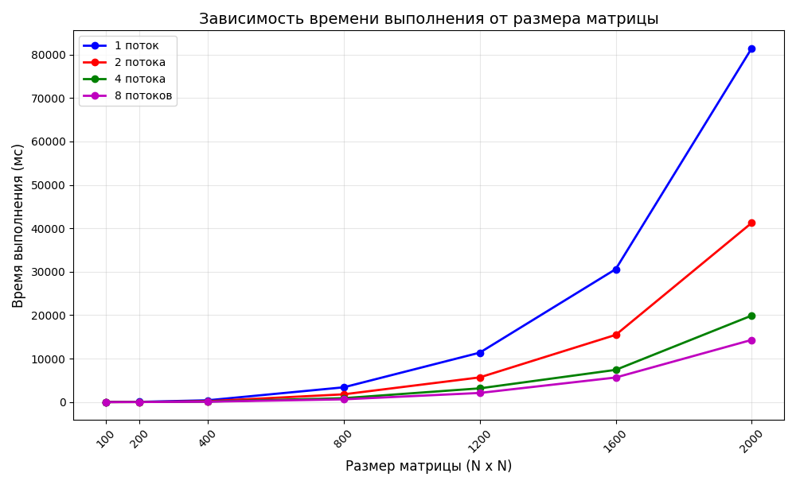

**Лабораторная работа:** №2
**Выполнил:** Ушаков Роман Сергеевич 
**Группа:** 6213-100503D 

## 1. Цель работы
Модифицировать программу из лабораторной работы №1 для параллельного перемножения квадратных матриц с использованием технологии OpenMP. Провести серию экспериментов с разным количеством потоков (1, 2, 4, 8) и разными размерами матриц (100×100, 200×200, 400×400, 800×800, 1200×1200, 1600×1600, 2000×2000). Оценить эффективность параллелизации и построить графики зависимости времени выполнения от размера матрицы для каждого количества потоков.

## 2. Реализация параллельного умножения с использованием OpenMP

### 2.1. Модификация алгоритма
В данной лабораторной работе программа из ЛР №1 была модифицирована для параллельного выполнения с помощью технологии OpenMP. Основное изменение коснулось оператора умножения матриц в классе `Matrix`:

```cpp
Matrix operator*(const Matrix<T>& other) const {
		if (_columns != other.rows()) {
			throw std::invalid_argument("Число столбцов первой матрицы должно быть равно числу строк второй!");
		}

		Matrix<T> matr(_rows, other.columns());

		#pragma omp parallel for
		for (int i = 0; i < _rows; i++) {
			for (int j = 0; j < other.columns(); j++) {
				for (int k = 0; k < _columns; k++) { 
					matr(i, j) += _data[i][k] * other(k, j);
				}
			}
		}

		return matr;
	}
```

## 3. Структура проекта
- `matrix.hpp` - Класс Matrix для работы с матрицей (OpenMP версия)
- `main.cpp` - Основной файл программы
- `create_matrix.py` - Генерация матриц и сохранение в файлы
- `verify.py` - Верификация результатов через NumPy
- `CMakeLists.txt` - Конфигурация для сборки проекта
- `info.txt` - Результаты экспериментов (время, количество операций, количество потоков)
- `graph.png` - График зависимости времени от размера матрицы для разных потоков

### 4. Экспериментальные данные

### 4.1. Генерация матриц
Для проведения экспериментов были сгенерированы квадратные матрицы следующих размеров:
- 100x100
- 200x200
- 400x400
- 800x800
- 1200x1200
- 1600x1600
- 2000x2000

Для каждого размера созданы две матрицы со случайными значениями.

### 4.2. Условия проведения экспериментов

- **Аппаратное обеспечение:** 8-ядерный процессор
- **Операционная система:** Windows 11
- **Количество потоков:** 1, 2, 4, 8
- **Размеры матриц:** 100×100, 200×200, 400×400, 800×800, 1200×1200, 1600×1600, 2000×2000

### 4.3. Результаты измерений

#### Таблица 1 - Время выполнения и объём вычислений

| № замера | Размер матрицы | Время выполнения, мс |
|:----------:|:----------------:|:----------------------:|
|**Число потоков - 1**|
| 1.1 | 100 × 100 | 10 |
| 1.2 | 200 × 200 | 51 |
| 1.3 | 400 × 400 | 409 |
| 1.4 | 800 × 800 | 3398 |
| 1.5 | 1200 × 1200 | 11375 |
| 1.6 | 1600 × 1600 | 30609 |
| 1.7 | 2000 × 2000 | 81478 |
|**Число потоков - 2**|
| 2.1 | 100 × 100 | 3 |
| 2.2 | 200 × 200 | 26 |
| 2.3 | 400 × 400 | 203 |
| 2.4 | 800 × 800 | 1783 |
| 2.5 | 1200 × 1200 | 5684 |
| 2.6 | 1600 × 1600 | 15475 |
| 2.7 | 2000 × 2000 | 41270 |
|**Число потоков - 4**|
| 3.1 | 100 × 100 | 2 |
| 3.2 | 200 × 200 | 15 |
| 3.3 | 400 × 400 | 117 |
| 3.4 | 800 × 800 | 896 |
| 3.5 | 1200 × 1200 | 3160 |
| 3.6 | 1600 × 1600 | 7417 |
| 3.7 | 2000 × 2000 | 19922 |
|**Число потоков - 8**|
| 4.1 | 100 × 100 | 2 |
| 4.2 | 200 × 200 | 14 |
| 4.3 | 400 × 400 | 84 |
| 4.4 | 800 × 800 | 634 |
| 4.5 | 1200 × 1200 | 2100 |
| 4.6 | 1600 × 1600 | 5657 |
| 4.7 | 2000 × 2000 | 14321 |

### 4.4. График зависимости времени от размера матрицы(с учётом количества потоков)



*Рисунок 1 - Зависимость времени выполнения от размера матрицы(с учётом количества потоков)*

## 5. Инструкция по запуску

### 5.1. Генерация матриц
```bash
python create_matrix.py
```

### 5.2. Сборка программы (CMake)
```bash
mkdir build
cd build
cmake ..
cmake --build .
```

### 5.3. Запуск программы умножения
```bash
# Windows
./lab2.exe

# Linux/macOS
./lab2
```

**Что происходит:**
1. Чтение `matrixA{size}x{size}.txt` и `matrixB{size}x{size}.txt`
2. Умножение матриц с подсчётом операций
3. Сохранение результатов:
   - `result{size}x{size}_{num_of_threads}.txt` - результирующая матрица
   - `info.txt` - время, количество операций, количество потоков

## 5.4. Верификация результатов
`python verify.py`

**Что происходит:**
- Чтение `matrixA{size}x{size}.txt` и `matrixB{size}x{size}.txt`
- Вычисление эталонного результата через NumPy (`np.dot`)
- Сравнение результатов с помощью `np.allclose`
- Вывод результата проверки в терминал

## 6. Вывод

Технология OpenMP является эффективным инструментом для параллелизации вычислительно ёмких задач, таких как умножение матриц. Полученные результаты подтверждают, что с увеличением количества потоков время выполнения существенно сокращается, что особенно заметно для больших размеров матриц. Наибольший эффект от использования 8 потоков наблюдается для матрицы 2000×2000 — ускорение в 5.69 раза.
