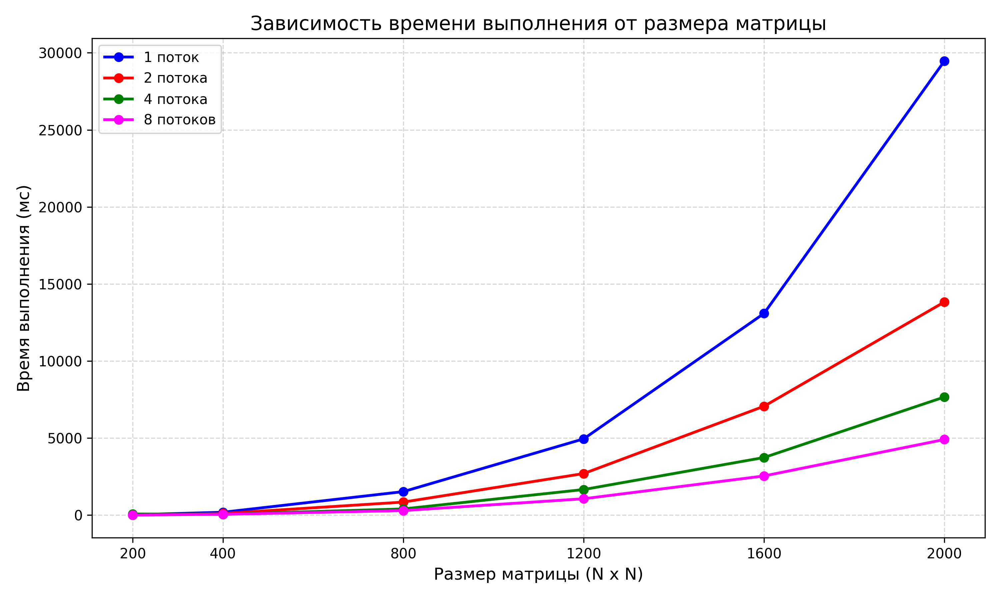

**Лабораторная работа:** №3
**Выполнил:** Ушаков Роман Сергеевич
**Группа:** 6213-100503D 

## 1. Цель работы
 Модифицировать программу из л/р №1 для параллельной работы по технологии MPI. Провести серию экспериментов с разным количеством потоков (1, 2, 4, 8) и разными размерами матриц (200×200, 400×400, 800×800, 1200×1200, 1600×1600, 2000×2000). Оценить эффективность параллелизации и построить графики зависимости времени выполнения от размера матрицы для каждого количества потоков.

## 2. Реализация параллельного умножения с использованием MPI

### 2.1. Модификация алгоритма

Основное изменение коснулось класса `Matrix` в файле `matrix.hpp`: добавлен метод `mpi_mult`, который распределяет строки матрицы между процессами, выполняет локальное умножение и собирает результат через `MPI_Reduce`.

```cpp
	Matrix mpi_mult(const Matrix<T>& other) const  {
		int rank, size;
        MPI_Comm_rank(MPI_COMM_WORLD, &rank);
        MPI_Comm_size(MPI_COMM_WORLD, &size);

        if (_size % size != 0) {
            throw std::exception("Размер матрицы должен делиться на количество процессов");
        }

        int rows_per_proc = _size / size;
        int start_row = rank * rows_per_proc;
        
        Matrix<T> res(_size); 
        Matrix<T> local_res(_size);

        for (int i = start_row; i < start_row + rows_per_proc; ++i) {
            for (int j = 0; j < _size; ++j) {
                T sum = 0;
                for (int k = 0; k < _size; ++k) {
                    sum += _data[i * _size + k] * other._data[k * _size + j];
                }
                local_res(i, j) = sum;
            }
        }

        MPI_Datatype mpi_type;
        if constexpr (std::is_same_v<T, float>) mpi_type = MPI_FLOAT;
        else if constexpr (std::is_same_v<T, double>) mpi_type = MPI_DOUBLE;

		MPI_Reduce(local_res._data, res._data, _size * _size, mpi_type, MPI_SUM, 0, MPI_COMM_WORLD);

        return res;
	}
```

## 3. Структура проекта
- `matrix.hpp` - Класс Matrix с методом mpi_mult для параллельного умножения
- `main.cpp` - Основной файл программы
- `run.bat` - Скрипт для автоматического запуска тестов с 1, 2, 4, 8 процессами
- `CMakeLists.txt` - Конфигурация сборки с поддержкой MPI
- `info.txt` - Результаты экспериментов
- `graph.png` - График зависимости времени от размера матрицы для разных количеств процессов
- `create_matrix.py` - Генерация матриц и сохранение в файлы
- `verify.py` - Верификация результатов через NumPy

### 4. Экспериментальные данные

### 4.1. Генерация матриц
Для проведения экспериментов были сгенерированы квадратные матрицы следующих размеров:
- 200x200
- 400x400
- 800x800
- 1200x1200
- 1600x1600
- 2000x2000

Для каждого размера созданы две матрицы со случайными значениями.

### 4.2. Условия проведения экспериментов

- **Аппаратное обеспечение:** 8-ядерный процессор
- **Операционная система:** Windows 11
- **Количество потоков:** 1, 2, 4, 8
- **Размеры матриц:** 200×200, 400×400, 800×800, 1200×1200, 1600×1600, 2000×2000

### 4.3. Результаты измерений

#### Таблица 1 - Время выполнения и объём вычислений

| № замера | Размер матрицы | Время выполнения, мс |
|:----------:|:----------------:|:----------------------:|
|**Число потоков - 1**|
| 1.1 | 200 × 200 | 23 |
| 1.2 | 400 × 400 | 184 |
| 1.3 | 800 × 800 | 1522 |
| 1.4 | 1200 × 1200 | 4946 |
| 1.5 | 1600 × 1600 | 13086 |
| 1.6 | 2000 × 2000 | 29467 |
|**Число потоков - 2**|
| 2.1 | 200 × 200 | 11 |
| 2.2 | 400 × 400 | 104 |
| 2.3 | 800 × 800 | 843 |
| 2.4 | 1200 × 1200 | 2695 |
| 2.5 | 1600 × 1600 | 7063 |
| 2.6 | 2000 × 2000 | 13832 |
|**Число потоков - 4**|
| 3.1 | 200 × 200 | 72 |
| 3.2 | 400 × 400 | 54 |
| 3.3 | 800 × 800 | 399 |
| 3.4 | 1200 × 1200 | 1658 |
| 3.5 | 1600 × 1600 | 3736 |
| 3.6 | 2000 × 2000 | 7663 |
|**Число потоков - 8**|
| 4.1 | 200 × 200 | 4 |
| 4.2 | 400 × 400 | 51 |
| 4.3 | 800 × 800 | 292 |
| 4.4 | 1200 × 1200 | 1060 |
| 4.5 | 1600 × 1600 | 2540 |
| 4.6 | 2000 × 2000 | 4906 |

### 4.4. График зависимости времени от размера матрицы(с учётом количества потоков)



*Рисунок 1 - Зависимость времени выполнения от размера матрицы(с учётом количества потоков)*

## 5. Инструкция по запуску

Для удобства все этапы (генерация, сборка, запуск тестов и верификация) автоматизированы в скрипте `run.bat`.

### 5.1. Автоматический запуск всех этапов
Просто запустите файл `run.bat` в корневой директории проекта:

```bash
run.bat
```

**Что делает скрипт:**

1.  Удаляет старую папку `matrices` (если существует).
2.  Генерирует новые матрицы через `python create_matrix.py`.
3.  Создает папку `build` и собирает проект через CMake.
4.  Очищает файл `info.txt` от старых данных.
5.  Последовательно запускает исполняемый файл `lab3.exe` через `mpiexec` с 1, 2, 4 и 8 процессами.
6.  Запускает верификацию результатов через `python verify.py`.

## 6. Вывод

Технология MPI является эффективным инструментом для параллелизации вычислительно ёмких задач, таких как умножение матриц. Полученные результаты подтверждают, что с увеличением количества процессов время выполнения существенно сокращается, что особенно заметно для больших размеров матриц. Наибольший эффект от использования 8 процессов наблюдается для матрицы 2000×2000 - ускорение в 6.01 раза (с 29467 мс до 4906 мс).