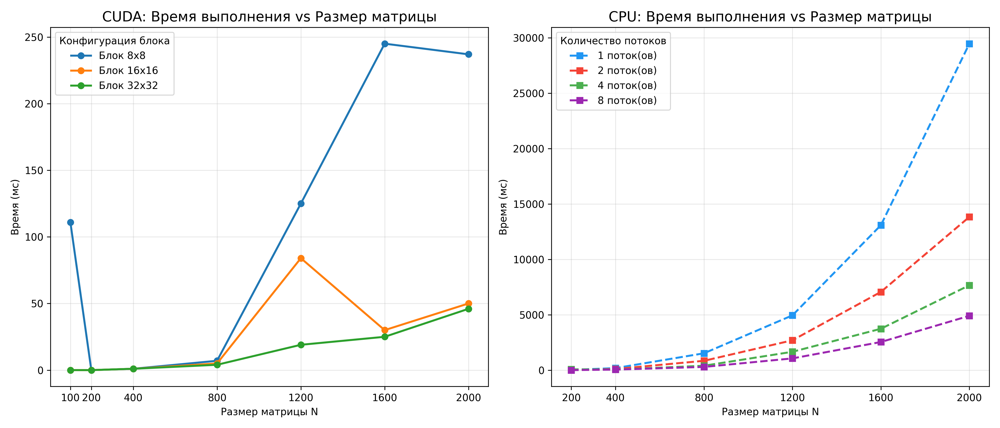

**Лабораторная работа:** №4
**Выполнил:** Ушаков Роман Сергеевич  
**Группа:** 6213-100503D 

## 1. Цель работы
Модификация программы перемножения квадратных матриц для параллельного выполнения на графическом процессоре (GPU) с использованием технологии NVIDIA CUDA. Проведение серии экспериментов с различными размерами матриц и конфигурациями сетки блоков (grid/block configuration) для оценки производительности.

## 2. Структура проекта
- `matrix.hpp` - Класс Matrix, для работы с матрицей
- `main.cu` - Основной файл реализации. Содержит ядро CUDA (`mat_mul_kernel`) и логику запуска экспериментов.
- `create_matrix.py` - Генерация матриц и сохранение в виде файла
- `verify.py` - Проверка результатов через NumPy
- `CMakeLists.txt` - Конфигурация для сборки проекта
- `info8x8.txt`, `info16x16.txt`, `info32x32.txt` - Файлы с результатами измерений времени выполнения и объема вычислений
- `graph.png` - График зависимости времени от размера матрицы (GPU vs CPU)

## 3. Ход работы

### 3.1. Реализация алгоритма
Для параллельного умножения матриц $C = A \times B$ размером $N \times N$ использовался подход, при котором каждый поток CUDA вычисляет один элемент результирующей матрицы $C_{ij}$.

**Ядро CUDA:**
```cpp
__global__ void mat_mul_kernel(const float* a, const float* b, float* c, size_t n) {
   size_t row = blockIdx.y * blockDim.y + threadIdx.y;
   size_t col = blockIdx.x * blockDim.x + threadIdx.x;

   if (row < n && col < n) {
      float sum = 0.0f;
      for (size_t k = 0; k < n; ++k) {
         sum += a[row * n + k] * b[k * n + col];
      }
      c[row * n + col] = sum;
   }
}
```

### 3.2. Результаты измерений

В таблице ниже приведено время выполнения умножения матриц для различных конфигураций блоков.

| Размер матрицы (N) | Объем работы (операций) | Время (Блок 8x8), мс | Время (Блок 16x16), мс | Время (Блок 32x32), мс |
| :---: | :---: | :---: | :---: | :---: |
| 100 | 2 000 000 | 111 | 0 | 0 |
| 200 | 16 000 000 | 0 | 0 | 0 |
| 400 | 128 000 000 | 1 | 1 | 1 |
| 800 | 1 024 000 000 | 7 | 5 | 4 |
| 1200 | 3 456 000 000 | 125 | 84 | 19 |
| 1600 | 8 192 000 000 | 245 | 30 | 25 |
| 2000 | 16 000 000 000 | 237 | 50 | 46 |

### 3.3. График зависимости времени от размера матрицы



*Рисунок 1 - Зависимость времени выполнения от размера матрицы (GPU vs CPU)*

## 4. Инструкция по запуску

### 4.1. Генерация матриц
```bash
python create_matrix.py
```

### 4.2. Сборка программы (CMake)
```bash
mkdir build
cd build
cmake ..
cmake --build .
```

### 4.3. Запуск программы умножения
```bash
# Windows
./LinkedList.exe

# Linux/macOS
./LinkedList
```

### 4.4. Верификация результатов
`python verify.py`

## 5. Выводы

В ходе лабораторной работы была реализована параллельная версия умножения матриц на CUDA. Эксперименты показали, что выбор конфигурации блоков существенно влияет на производительность. Для используемого GPU (GTX 1660 Ti) оптимальной оказалась конфигурация блока **32x32**, которая обеспечивает наилучший баланс между использованием регистров и коалесцированным доступом к памяти. Полученные результаты подтверждают эффективность использования GPU для задач линейной алгебры большой размерности.