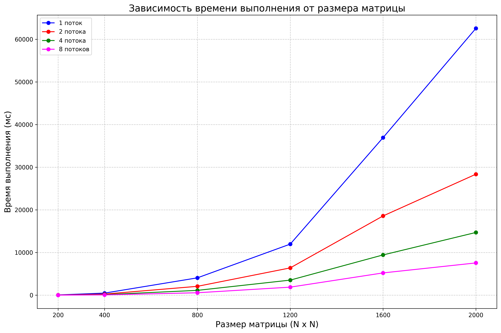

# Лабораторная работа: №5
**Выполнил:** Ушаков Роман Сергеевич  
**Группа:** 6213-100503D  

## 1. Цель работы
Модифицировать программу из л/р №1 для параллельной работы по технологии **MPI**. Провести серию экспериментов с разным количеством процессов (1, 2, 4, 8) и разными размерами матриц (200×200, 400×400, 800×800, 1200×1200, 1600×1600, 2000×2000). Оценить эффективность параллелизации и построить графики зависимости времени выполнения от размера матрицы.

## 2. Реализация параллельного умножения с использованием MPI

### 2.1. Модификация алгоритма

Основное изменение коснулось класса `Matrix` в файле `matrix.hpp`: добавлен метод `mpi_mult`, который распределяет столбцы второй матрицы между процессами, выполняет локальное умножение и собирает результат через `MPI_Reduce`.

```cpp
	Matrix mpi_mult(const Matrix<T>& other) const {
		int rank, size;
		MPI_Comm_rank(MPI_COMM_WORLD, &rank);
		MPI_Comm_size(MPI_COMM_WORLD, &size);
		
		if (_size % size != 0) {
			std::stringstream ss;
			ss << "Matrix size (" << _size << ") must be divisible by number of processes (" << size << ")";
			throw ss.str();
		}
		
		Matrix<T> res(_size);
		Matrix<T> local_res(_size);
		
		size_t work = other._size / size;
		size_t local_start = rank * work;
		size_t local_end = (rank == size - 1) ? other._size : local_start + work;
		
		T* m2_block = new T[other._size * work];
		for (size_t j = local_start; j < local_end; ++j) {
			for (size_t i = 0; i < other._size; ++i) {
				m2_block[(j - local_start) * other._size + i] = other._data[i * other._size + j];
			}
		}
		
		for (size_t i = 0; i < _size; ++i) {
			for (size_t j = local_start; j < local_end; ++j) {
				T sum = 0;
				for (size_t k = 0; k < _size; ++k) {
					sum += _data[i * _size + k] * other._data[k * _size + j];
				}
				local_res(i, j) = sum;
			}
		}
		
		delete[] m2_block;
		
		MPI_Datatype mpi_type;
		if (sizeof(T) == sizeof(float)) {
			mpi_type = MPI_FLOAT;
		} else {
			mpi_type = MPI_DOUBLE;
		}
		
		MPI_Reduce(local_res._data, res._data, _size * _size, mpi_type, MPI_SUM, 0, MPI_COMM_WORLD);
		
		return res;
	}
```

## 3. Структура проекта
- `matrix.hpp` - Класс Matrix с методом mpi_mult для параллельного умножения
- `main.cpp` - Основной файл программы
- `info.txt` - Результаты экспериментов
- `graph.png` - График зависимости времени от размера матрицы для разных количеств процессов
- `create_matrix.py` - Генерация матриц и сохранение в файлы
- `verify.py` - Верификация результатов через NumPy
- `lab5.pbs` - Cкрипт задания для планировщика задач

### 4. Экспериментальные данные

### 4.1. Генерация матриц
Для проведения экспериментов были сгенерированы квадратные матрицы следующих размеров:
- 200x200
- 400x400
- 800x800
- 1200x1200
- 1600x1600
- 2000x2000

Для каждого размера созданы две матрицы со случайными значениями.

### 4.2. Результаты измерений

#### Таблица 1 - Время выполнения и объём вычислений

| № замера | Размер матрицы | Время выполнения, мс |
|:----------:|:----------------:|:----------------------:|
|**Число потоков - 1**|
| 1.1 | 200 × 200 | 56 |
| 1.2 | 400 × 400 | 484 |
| 1.3 | 800 × 800 | 4062 |
| 1.4 | 1200 × 1200 | 11973 |
| 1.5 | 1600 × 1600 | 36947 |
| 1.6 | 2000 × 2000 | 62577 |
|**Число потоков - 2**|
| 2.1 | 200 × 200 | 30 |
| 2.2 | 400 × 400 | 256 |
| 2.3 | 800 × 800 | 2073 |
| 2.4 | 1200 × 1200 | 6397 |
| 2.5 | 1600 × 1600 | 18582 |
| 2.6 | 2000 × 2000 | 28372 |
|**Число потоков - 4**|
| 3.1 | 200 × 200 | 15 |
| 3.2 | 400 × 400 | 129 |
| 3.3 | 800 × 800 | 1127 |
| 3.4 | 1200 × 1200 | 3532 |
| 3.5 | 1600 × 1600 | 9437 |
| 3.6 | 2000 × 2000 | 14706 |
|**Число потоков - 8**|
| 4.1 | 200 × 200 | 8 |
| 4.2 | 400 × 400 | 65 |
| 4.3 | 800 × 800 | 566 |
| 4.4 | 1200 × 1200 | 1882 |
| 4.5 | 1600 × 1600 | 5220 |
| 4.6 | 2000 × 2000 | 7562 |

### 4.3. График зависимости времени от размера матрицы(с учётом количества потоков)



*Рисунок 1 - Зависимость времени выполнения от размера матрицы(с учётом количества потоков)*

## 5. Вывод

Технология MPI показала высокую эффективность при умножении матриц, обеспечивая ускорение в 8.27 раза для размера 2000×2000 при использовании 8 процессов (с 62 577 мс до 7 562 мс), что близко к линейному масштабированию. Накладные расходы на коммуникацию заметны лишь на малых матрицах, тогда как для больших задач распределение нагрузки работает оптимально. Запуск программы на суперкомпьютере позволяет использовать более производительные вычислительные узлы, что критически важно для дальнейшего масштабирования задачи на десятки и сотни процессов. Таким образом, цель лабораторной работы достигнута: программа успешно модифицирована под MPI, проведены эксперименты, построены графики и подготовлена инфраструктура для запуска на суперкомпьютере.
